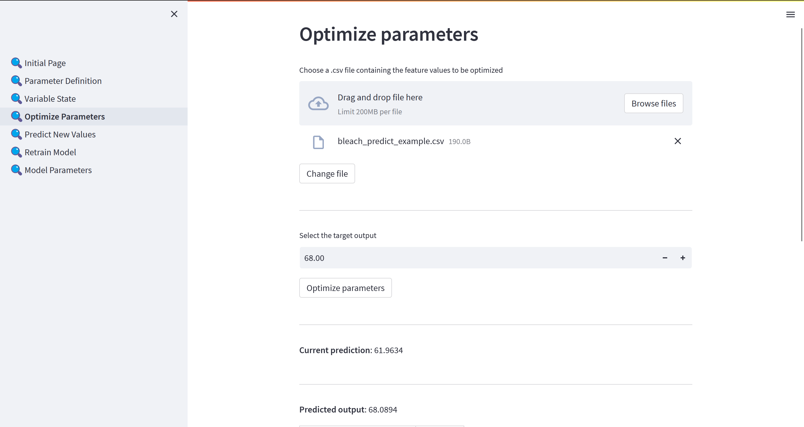
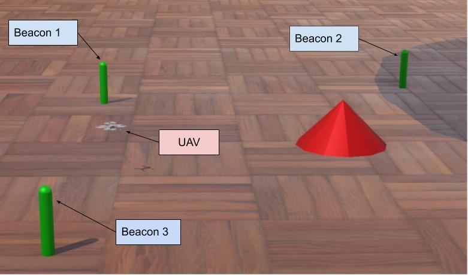
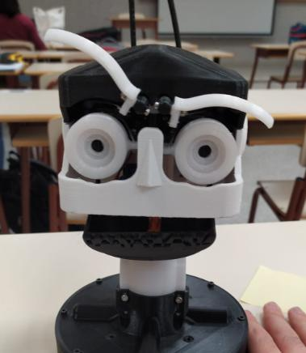

[Home](index.md)

## List

- [Sensor System for Predictive Maintenance](#sensor-system-for-predictive-maintenance)
- [ML Regression Toolkit](#ml-regression-toolkit-internship)
- [Extended Kalman Filter for a Quadcopter](#extended-kalman-filter-for-a-quadcopter)
- [Ancelotti Robot](#ancelotti-robot)
- [Palletizer Robotic Arm](#palletizer-robotic-arm)
- [SiiuuTunes](#siiuutunes)
- [Bonus](#bonus)

## Projects

## Sensor System for Predictive Maintenance

Sensor module design, embedded development, and ML for predictive maintenance.  
It was developed in the scope of the [GreenAuto](https://www.agendagreenauto.pt/projeto/) Project.

This project explored the implementation of Predictive Maintenance in manufacturing environments that relied on legacy machinery lacking modern sensor capabilities. A wireless sensor system was developed using IoT hardware and Machine Learning algorithms to monitor equipment health through vibration, sound, and temperature data.

The system was designed specifically for Automated Guided Vehicles (AGVs) and nearby machines, with a focus on cost-effectiveness and space constraints. Data preprocessing techniques based on time-domain features were employed to minimize wireless data transmission. Supervised learning models delivered highly accurate anomaly detection results, while unsupervised models performed poorly. A comparative analysis of sensors with varying costs was also conducted to evaluate their performance.

This work demonstrated how emerging technologies could extend Industry 4.0 capabilities to older equipment, reducing downtime and optimizing maintenance schedules.

You can read the full dissertation here: [Dissertation](documents/SensorSystemForPredictiveMaintenanceInIndustrialEnvironments.pdf)

### Highlights

### Lowlights

- I only noticed that there was a typo in the title the day before presenting the dissertation. Still feel a bit embarrassed.

### Lessons Learned

## ML Regression Toolkit (Internship)

This project was developed to solve generic regression problems by finding optimal input parameters for a desired target output using machine learning. It employed the XGBoost library's XGBRegressor for predictions, with hyperparameter tuning handled by Hyperopt, and feature optimization performed using simulated annealing via SciPy’s dual_annealing.

The app featured a user-friendly Streamlit interface, though the machine learning logic was modularized to support integration with other frontends. Users could train models on custom datasets, make predictions from new inputs, and find optimal parameter configurations to approach a target output. The system supported both continuous and discrete variables and allowed detailed model explanation using SHAP values.

A key functionality included incremental model retraining, which significantly reduced computational overhead. Additionally, project configurations were saved using JSON templates for persistent and repeatable workflows. Feature importance was visualized through SHAP beeswarm plots, offering intuitive insights into the model’s decision-making process.

While the toolkit was designed with extensibility in mind, further improvements were identified, such as better discrete optimization via mixed-integer programming, more advanced SHAP plots, and real-time convergence visualization during optimization.

Take a look at the project in the [repo](https://github.com/AndreEnes/argentina-opt).

### Highlights

- This internship was right after I had my Machine Learning class, so I got to work on a real project with it right away.
- 1st experience in a "work environment" where I got to participate in academic research.
- The objective of the project was very palpable, so it was great to see improvements daily.
- Streamlit is awesome!

### Lowlights

- Pre ChatGPT days made setting up Python packages a bit messy, since I had little to no guidance on how to properly use all the tools to make software development more reliable.
- The code was quite messy. I don't want to look at it again.
- Streamlit is great, but for bigger projects, it becomes hard to deal with.
- I'm not sure if anyone used it.

### Lessons Learned

## Extended Kalman Filter for a Quadcopter

This project focused on 3D localization of an aerial robot (UAV) using an Extended Kalman Filter (EKF) with beacon-based distance measurements. It was implemented using Python, C++, ROS, and Webots to estimate the UAV’s position by fusing noisy data from static beacons with a motion model. The work included:

- Designing state and measurement models for UAV motion.
- Developing a nonlinear observation model based on beacon distances.
- Implementing an EKF with dynamic Jacobian updates.
- Creating ROS nodes for beacons, the UAV, and the filter logic.
- Running simulations and visualizations in Webots and Jupyter.

Extensive testing demonstrated that the EKF accurately estimated the UAV’s position under various conditions, including sensor noise, beacon layout changes, and signal loss.
You can check the report [here (in spanish)](documents/ROS_EKF_WITH_BEACONS.pdf).

### Highlights

- Had to understand how to apply theory to practice.
- Gained a lot of experience with handling messy tools like WeBots. The support was poor and ChatGPT was still at a point where you were lucky if it was available due to the high demand, so I spent many hours banging my head against the wall.
- Got to see lots of cool drones in one of the laboratories of the Universidad de Sevilla, namely through the [Griffin](https://griffin-erc-advanced-grant.eu/) project.
- The report and presentation were done fully in Spanish.

### Lowlights

- At the time, my knowledge was more limited regarding software tools like Docker. It slowed me down considerably due to having to work with tools like ROS and WeBots.
- I had a basically incompatible schedule with my group partner, so working together was not easy and there was some duplicated work.

### Lessons Learned

- Although software development tools like Docker are often not the most important part of a project, they make it easier to get to your end goal.
- Robotics is a really broad field and the possibilities are never ending.
- Unless open source tools get a dedicated team to them, documentation and tutorials will probably be scarce.
- Probing around is a good way to learn.
- Try to be ready for meetings ahead of time. Having clear goals is a timesaver.

### Cool Drones

Here are some pictures of cool drones that were in the [Griffin](https://griffin-erc-advanced-grant.eu/) project laboratory:

## Ancelotti Robot

This project explored the integration of facial gesture recognition and animatronic control by developing a system in which a robotic head imitated human facial movements in real time. Using a webcam and [MediaPipe's Face Mesh](https://ai.google.dev/edge/mediapipe/solutions/vision/face_landmarker), facial landmarks were detected and analyzed to track expressions such as eye movement, eyebrow position, and mouth motion.

Servo control of the animatronic head was achieved using a Pololu Mini Maestro controller, initially interfaced via an Arduino UNO and later optimized with a pure Python-based solution, reducing hardware complexity. The robotic head, AnimaTRON 1.0, included eight servos that replicated facial gestures based on normalized landmark distances.

Although originally intended to integrate Botszy, a professional animatronic rigging platform, the project faced compatibility issues and proceeded with a manual software implementation.

Check the [report](documents/Ancelotti_Robot.pdf) for more information.

### Highlights

### Lowlights

### Lessons Learned

## Palletizer Robotic Arm

This project involved building and programming a robotic arm in a "Palletizer" configuration capable of sorting three objects based on their color. The system used a TCS3200 color sensor to identify each object's color, and a set of SG90 servo motors to control the robotic arm's movements. Once identified, the object was placed in the corresponding position for its color.

The arm's components and motion paths—including sensor, object pickup, and drop-off positions—were configurable via buttons and a 16x2 LCD, which also displayed real-time status updates. Configurations were stored in the EEPROM, enabling persistent memory between sessions.

To control four servo motors using limited PWM outputs, a transistor-multiplexing approach was implemented, optimizing pin usage on the Atmega328p microcontroller. Each servo had an associated state machine for movement control, and calibration modes were built in to allow fine-tuned positioning.

The color detection logic analyzed pulse frequency from the sensor using external timers to determine RGB values and classify the object. The system’s flow was structured as a finite state machine, allowing a seamless process from object detection to classification and placement.

Overall, the project demonstrated low-level embedded systems programming, motor control, sensor integration, and state-machine-based automation.

### Highlights

- Inspired interest in embedded systems
- Used different types of components
- Hardware restrictions lead to creative solutions
  - The microcontroller only has 2 ports capable of running the servo motors, so separate transistors were used to make a "pin selector" to change how the pins were connected to each servo.

### Lowlights

- It was during the covid lockdown, so access to hardware tools was quite limited which made it harder to debug.
- The component precision was low, so the whole project was a bit finnicky.
- Single buttons make for annoying _"User Interfaces"_.

### Lessons Learned

- One must be careful with hardware, frying the chip is not difficult.
- Necessity really leads to ingenuity.

## SiiuuTunes

This C++ project aimed to replicate core Spotify functionality, featuring multiple user roles: listener, artist, and admin. Users could sign up, create playlists, search songs, report artists, and explore promoted tracks.

Despite facing major challenges with MSYS2 library installations, GUI management, MP3 playback, and metadata extraction, the app implemented key features including:

- Role-based interface and permissions
- Dynamic playlists with song addition (handling SQL injection via input sanitization)
- A “SiiiUTunes” tab showcasing artist-promoted content
- Artist-specific menus for uploading songs
- Basic search and report mechanisms

Due to time constraints and limited documentation for audio libraries, MP3 playback was not fully implemented, though the team gained the necessary technical understanding and could have completed it with 1–2 more days.

### Highlights

### Lowlights

### Lessons Learned

## Bonus

### Ray Tracer

I followed this book to practice some C/C++ while learning something outside "my realm": [Ray Tracing In One Weekend](https://raytracing.github.io/books/RayTracingInOneWeekend.html). It takes you from nothing to creating an image like this:

It is quite easy to follow and super satisfying to see some basic renders. The final results is very "bare bones", so a typo will leave you with something wrong like this:

It only took like 1 hour to render, yey.
