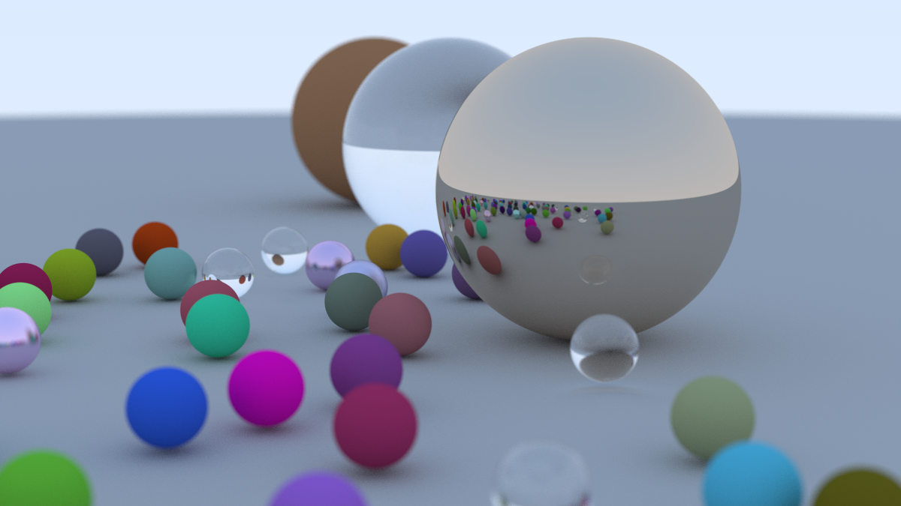
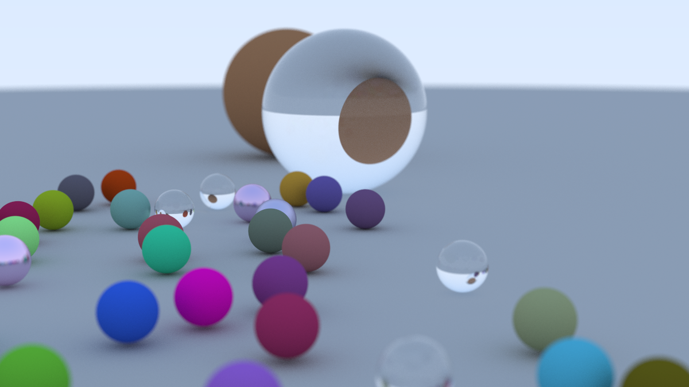

<link rel="stylesheet" href="/assets/css/style.css">

[Home](index.md) | [Projects](projects.md) | [Experience](experience.md) | [Education](education.md)

## List

1. Sensor System for Predictive Maintenance
2. ML Regression Toolkit
3. Extended Kalman Filter for a Quadcopter
4. Ancelotti Robot
5. SiiuuTunes
6. Palletizer Robotic Arm
7. Bonus

## Projects

### Sensor System for Predictive Maintenance

Sensor module design, embedded development, and ML for predictive maintenance.  
[Read more](https://www.agendagreenauto.pt/projeto/)

#### Highlights

#### Lowlights

#### Lessons Learned

### ML Regression Toolkit (Internship)

Python toolkit using XGBoost, SHAP, and Streamlit for regression optimization.

#### Highlights

#### Lowlights

#### Lessons Learned

### Extended Kalman Filter for a Quadcopter

Developed a 3D position estimation system for an aerial robot using an Extended Kalman Filter (EKF). The setup involved static beacons placed at known locations, measuring distances to the robot.

Built with Webots, ROS, Python, and C++, the system integrates sensor data and simulates beacon-based localization. The project covered EKF development, implementation, and analysis of results.

#### Highlights

- Had to understand how to apply theory to practice.
- Gained a lot of experience with handling with messy tools like WeBots. The support was poor and ChatGPT was still at a point where you were lucky if it was available due to the high demand, so I spent many hours banging my head against the wall.
- Got to see lots of cool drones in one of the laboratories of the Universidad de Sevilla, namely through the [Griffin](https://griffin-erc-advanced-grant.eu/) project.
- The report and presentation were done fully in Spanish.

#### Lowlights

- At the time, my knowledge was more limited regarding software tools like Docker. It slowed me down considerably due to having to work with tools like ROS and WeBots.

#### Lessons Learned

#### Cool Drones

Open to see some cool drones. (Click the arrows to open each image).

  
📷 Big Boy

  
📷 Tunnel Inspection Boy

  
📷 Birdie

  
📷 Blurry Pipe Boy

### Palletizer Robotic Arm

3D Printed Palletizer servo-controlled arm. Objective: pick up pieces and organized them by colour. Components: servo motors, colour sensor, lcd, ATmega328p.

### Highlights

- Inspired interest in embedded systems
- Used different types of components
- Hardware restrictions lead to creative solutions
  - The microcontroller only has 2 ports capable of running the servo motors, so separate transistors were used to make a "pin selector" to change how the pins were connected to each servo.

### Lowlights

- It was during the covid lockdown, so access to hardware tools was quite limited which made it harder to debug
- The component percision was low, so the whole project was a bit finnicky

### Lessons Learned

- One must be careful with hardware, frying the chip is not difficult
- Necessity really leads to enginuity

### Bonus

#### Ray Tracer

I followed this book to practice some C/C++ while learning something outside "my realm": [Ray Tracing In One Weekend](https://raytracing.github.io/books/RayTracingInOneWeekend.html). It takes you from nothing to creating an image like this (click the arrow to open the image):

  
📷 Final rendered image

It is quite easy to follow and super satisfying to see some basic renders. The final results is very "bare bones", so a typo will leave you with something wrong like this:

  
📷 Oopsie

It only took like 1 hour to render, yey.
